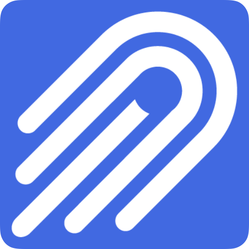

# Nylas Code Samples

**Open-source examples for the Nylas APIs.**
Snippets and reference apps across every official SDK — Email, Calendar,
Contacts, Scheduler, Notetaker, and Webhooks.

[Sign up](https://dashboard-v3.nylas.com/register) ·
[Docs](https://developer.nylas.com) ·
[CLI docs](https://cli.nylas.com) ·
[Main org](https://github.com/nylas) ·
[Forum](https://forums.nylas.com) ·
[Blog](https://nylas.com/blog)

## Get started

[Sign up](https://dashboard-v3.nylas.com/register) to create an app and generate an API key. Or do it from the terminal:

```bash
brew install nylas/nylas-cli/nylas
nylas init
```

More options in the [CLI getting-started guide](https://cli.nylas.com/guides/getting-started). Then pick a quickstart for your stack — see below.

## Quickstarts — pick your stack

Per-product quickstart guides, available across every official SDK.

**Products:**
[Email](https://github.com/orgs/nylas-samples/repositories?q=quickstart+email) ·
[Calendar](https://github.com/orgs/nylas-samples/repositories?q=quickstart+calendar) ·
[Contacts](https://github.com/orgs/nylas-samples/repositories?q=quickstart+contacts) ·
[Scheduler](https://github.com/orgs/nylas-samples/repositories?q=quickstart+scheduler) ·
[Webhooks](https://github.com/orgs/nylas-samples/repositories?q=quickstart+webhook)

**Languages:**
[Node.js](https://github.com/orgs/nylas-samples/repositories?q=quickstart+node) ·
[Python](https://github.com/orgs/nylas-samples/repositories?q=quickstart+python) ·
[Ruby](https://github.com/orgs/nylas-samples/repositories?q=quickstart+ruby) ·
[Java](https://github.com/orgs/nylas-samples/repositories?q=quickstart+java) ·
[Kotlin](https://github.com/orgs/nylas-samples/repositories?q=quickstart+kotlin)

A few good entry points:

- [**quickstart-email-python**](https://github.com/nylas-samples/quickstart-email-python) — send and read email with the Python SDK.
- [**quickstart-calendar-node**](https://github.com/nylas-samples/quickstart-calendar-node) — manage events with the Node.js SDK.
- [**quickstart-v3-scheduler-nextjs**](https://github.com/nylas-samples/quickstart-v3-scheduler-nextjs) — embed the Nylas Scheduler in a Next.js app.
- [**quickstart-nylas-connect-react-spa**](https://github.com/nylas-samples/quickstart-nylas-connect-react-spa) — hosted auth in a React SPA with `@nylas/connect`.

Or [browse all quickstarts](https://github.com/orgs/nylas-samples/repositories?q=quickstart).

## Reference apps & integrations

Standalone projects that go a bit further than a quickstart.

- [**meeting-notes-generator**](https://github.com/nylas-samples/meeting-notes-generator) — generate meeting notes with Nylas Notetaker and AI.
- [**nylas-api-mcp**](https://github.com/nylas-samples/nylas-api-mcp) — experimental MCP server for the Nylas API.
- [**TinyMCE-Nylas-Email-API**](https://github.com/nylas-samples/TinyMCE-Nylas-Email-API) — rich-text email composer using TinyMCE and the Email API.
- [**node-email-responder-ai**](https://github.com/nylas-samples/node-email-responder-ai) — auto-respond to emails with generative AI.
- [**next-js-nylas-auth-flow**](https://github.com/nylas-samples/next-js-nylas-auth-flow) — full Nylas auth flow in Next.js.

## Browse the org

By product:
[Email](https://github.com/orgs/nylas-samples/repositories?q=email) ·
[Calendar](https://github.com/orgs/nylas-samples/repositories?q=calendar) ·
[Contacts](https://github.com/orgs/nylas-samples/repositories?q=contact) ·
[Scheduler](https://github.com/orgs/nylas-samples/repositories?q=scheduler) ·
[Webhooks](https://github.com/orgs/nylas-samples/repositories?q=webhook) ·
[Auth](https://github.com/orgs/nylas-samples/repositories?q=auth)

By language:
[Node.js](https://github.com/orgs/nylas-samples/repositories?q=node) ·
[Python](https://github.com/orgs/nylas-samples/repositories?q=python) ·
[Ruby](https://github.com/orgs/nylas-samples/repositories?q=ruby) ·
[Java](https://github.com/orgs/nylas-samples/repositories?q=java)

## Try it in Postman

Three collections in the [public workspace](https://www.postman.com/trynylas/nylas-api), pre-wired and ready to fork.

| Collection | Run |
|---|---|
| **Administration** | [](https://god.gw.postman.com/run-collection/21157315-07346e8d-7c2c-43d4-87f6-2a8b6ebc4b30?action=collection%2Ffork&source=rip_markdown&collection-url=entityId%3D21157315-07346e8d-7c2c-43d4-87f6-2a8b6ebc4b30%26entityType%3Dcollection%26workspaceId%3De36cf1fc-a749-494d-9c8c-f3c28f18c342) |
| **Email, Calendar, Contacts & Notetaker** | [](https://god.gw.postman.com/run-collection/21157315-b864762a-ddbb-4e08-bcc5-e87bb51a825a?action=collection%2Ffork&source=rip_markdown&collection-url=entityId%3D21157315-b864762a-ddbb-4e08-bcc5-e87bb51a825a%26entityType%3Dcollection%26workspaceId%3De36cf1fc-a749-494d-9c8c-f3c28f18c342) |
| **Scheduler** | [](https://god.gw.postman.com/run-collection/21157315-91771656-d8a7-43c9-ad24-8533f43d6f35?action=collection%2Ffork&source=rip_markdown&collection-url=entityId%3D21157315-91771656-d8a7-43c9-ad24-8533f43d6f35%26entityType%3Dcollection%26workspaceId%3De36cf1fc-a749-494d-9c8c-f3c28f18c342) |

---

## SDKs

- [nylas-nodejs](https://github.com/nylas/nylas-nodejs) · `npm i nylas`
- [nylas-python](https://github.com/nylas/nylas-python) · `pip install nylas`
- [nylas-ruby](https://github.com/nylas/nylas-ruby) · `gem install nylas`
- [nylas-java](https://github.com/nylas/nylas-java) · Maven / Gradle

Community: [Teamwork/nylas-go](https://github.com/Teamwork/nylas-go),
[lanlin/nylas-php](https://github.com/lanlin/nylas-php).

## API reference

- [API](https://developer.nylas.com/docs/reference/api/)
- [Notifications](https://developer.nylas.com/docs/reference/notifications/)
- [UI components](https://developer.nylas.com/docs/reference/ui/)

## AI agents

[nylas/skills](https://github.com/nylas/skills) drops Nylas into Claude Code,
Cursor, Codex, and other agents that support the skills format:

```bash
npx skills add nylas/skills
/plugin marketplace add nylas/skills   # Claude Code
```

The CLI installs an MCP server for Claude Desktop, Claude Code, Cursor,
Windsurf, or VS Code:

```bash
brew install nylas/nylas-cli/nylas
nylas mcp install
```

Walkthrough: [give AI agents email access via MCP](https://cli.nylas.com/guides/give-ai-agents-email-access-via-mcp).

## Contributing

Pull requests welcome — see [CONTRIBUTING.md](https://github.com/nylas-samples/.github/blob/main/CONTRIBUTING.md). New to open source? The [starter template](https://github.com/nylas-samples/nylas-code-samples-starter) is a good place to begin.

## Connect

[Forum](https://forums.nylas.com) ·
[LinkedIn](https://www.linkedin.com/company/nylas/) ·
[X](https://twitter.com/nylas) ·
[YouTube](https://www.youtube.com/c/nylas)

---

_If you're interested in building Nylas, [come join us](https://www.nylas.com/company/jobs/)._
